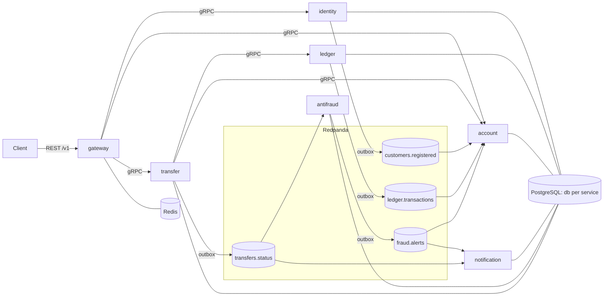
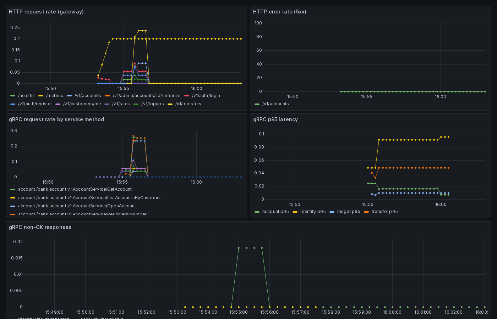
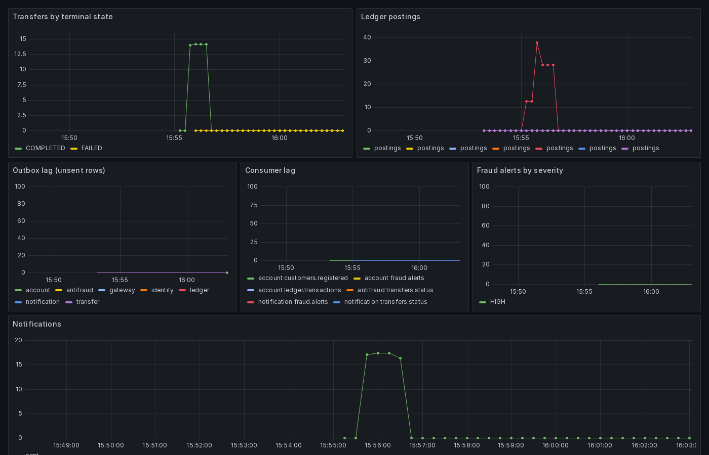

# bank-core

A portfolio-grade core-banking backend: seven Go microservices moving money
correctly under failure. Double-entry ledger as the single source of money
truth, saga-orchestrated transfers with hold/capture, transactional outbox +
consumer dedup over Kafka (Redpanda), async fraud scoring that freezes
accounts, and the operational proof: integration/e2e suites, load numbers,
and a chaos run with the ledger cut mid-saga.

Every non-obvious decision has an ADR: [docs/adr](docs/adr). The 10-minute
review path: this page → [architecture](docs/architecture.md) → the
[ledger](docs/services/ledger-service.md) and
[transfer](docs/services/transfer-service.md) docs.

## Architecture



Money truth lives only in the ledger: immutable journal entries (≥2 postings,
zero-sum per currency, enforced in code *and* by a deferred DB constraint
trigger), materialized versioned balances, holds for the transfer saga's
authorization phase. Customer-visible balances are eventually-consistent
projections rebuilt from the event log (`make replay-projections` proves it).

## Quickstart

```bash
make up                  # compose: 7 services + postgres + redpanda + redis + toxiproxy
make demo                # scripted E2E: registration → accounts → top-ups → FX → P2P → verify-ledger
make down
```

With observability (adds jaeger, prometheus, grafana with two provisioned
dashboards):

```bash
make up-observability    # grafana: localhost:3000, jaeger: localhost:16686
```

Verification targets:

```bash
make test                # unit tests, every module
make test-integration    # testcontainers: postgres + redpanda
make e2e                 # full scenario incl. fraud freeze (stack must be up)
make lint                # golangci-lint (depguard keeps domain packages stdlib-only) + buf lint
make coverage            # honest cross-package coverage per module (table below)
make verify-ledger       # double-entry reconciliation straight in ledger_db
make load                # k6: transfers + reads (results below)
make chaos               # cut transfer↔ledger mid-burst, prove recovery (transcript below)
make replay-projections  # rebuild the balance read model from offset 0
make helm-deploy         # k3d + umbrella chart + smoke (docs/deploy.md)
```

### Coverage

Real numbers from `make coverage` (cross-package via `-coverpkg`, so integration
tests credit the adapters/stores they exercise; excludes `cmd/` DI wiring and
generated sqlc code). Domain packages — the money invariants and the saga state
machine — sit at **95–100%**; the per-module figure below is the whole module
(domain + app + adapters):

| module | coverage | module | coverage |
|---|---|---|---|
| antifraud | 86% | account | 78% |
| pkg (shared) | 85% | notification | 78% |
| ledger | 79% | gateway | 77% |
| identity | 76% | transfer | 75% |

The black-box `tests/e2e` suite exercises the full wiring end-to-end but runs
out-of-process, so it does not register as Go statement coverage — the real
exercised fraction is higher than these numbers show.

## What the demo proves

`make demo` runs the full happy path through the gateway and ends with the
double-entry reconciliation. Real run (abridged):

```
▶ Open accounts: Alice KZT + USD, Bob KZT
▶ Top-ups: Alice 100,000.00 KZT + 1,000.00 USD; Bob 5,000.00 KZT
▶ INTERNAL FX transfer: Alice USD → Alice KZT, $200.00 at the locked rate
  counter_amount = 9,565,000 KZT   applied_rate = 478.250000
▶ P2P transfer: Alice KZT → Bob (by account number), 15,000.00 KZT
▶ Idempotency replay: same request + same Idempotency-Key → same transfer id
  ✔ replay returned the same transfer, no double spend
▶ verify-ledger: double-entry reconciliation
  ✔ every journal entry sums to zero per currency (invariant 1)
  ✔ materialized balance ≡ Σ postings for every account (invariant 4)
  ✔ total money in the system is conserved (Σ all postings = 0)
  verify-ledger: PASS — the books balance.
```

The fraud path is exercised by `make e2e`: a velocity burst trips the R2 rule
→ HIGH `fraud.alerts` event → account-service consumer sets the account
FROZEN → the next transfer is rejected `ACCOUNT_FROZEN` → notification rows
land for every terminal transfer. One trace in Jaeger spans
gateway → transfer → ledger → (Kafka) → account / antifraud / notification.

## Load (k6)

Measured on this dev laptop (Docker Desktop, ~7.5 GB) with `make load`. These
are real committed runs, not projections — reproduce with the stack up.

| Scenario | Offered load | Latency | Success | Throughput |
|---|---|---|---|---|
| `GET /v1/accounts` (projected balances) | 100 iters/s, 60s | **p95 = 4.44 ms**, p99 well under target | 100% (6000/6000 checks) | ~93 req/s |
| `POST /v1/transfers` (full synchronous saga + poll to terminal) | ramp 1→10 VUs, 80s | **p99 = 35.8 ms**, terminal-state p95 = 33 ms | 100% reach a terminal state | ~15 req/s |

Both scenarios beat the ADR-0016 targets (p99 < 500 ms transfer, p95 < 100 ms
reads) by more than 10×. Honest caveat: **throughput here is rate-limiter
bound, not capacity bound** — the gateway caps 10 rps/user reads and 2 rps/user
transfers, so ~26% of the offered transfer load is correctly shed as `429`
(the k6 client backs off; every accepted transfer still completes). This
measures latency and correctness under contention, not peak RPS.

## Chaos: the ledger dies mid-saga

`make chaos` starts a 30-transfer burst, disables the toxiproxy link between
transfer and ledger for 10 seconds in the middle of it, then waits. Real run:

```
burst finished: 30 transfers accepted by the gateway
⚡ waiting for the recovery worker to resolve every in-flight saga
  terminal: 19 completed, 11 failed; in-flight: 0
✔ every accepted transfer reached a terminal state (none stuck)
⚡ verify-ledger: money conserved through the outage
✔ every journal entry sums to zero per currency (invariant 1)
✔ materialized balance ≡ Σ postings for every account (invariant 4)
✔ no negative available balance on customer accounts (invariant 3)
✔ total money in the system is conserved (Σ all postings = 0)
verify-ledger: PASS — the books balance.
```

The 11 failures are transfers whose hold/post could not complete during the
10 s outage: the recovery worker released their holds and marked them FAILED
(no money moved). The 19 that had already posted completed. **Zero stuck, zero
lost or double-moved money** — the ledger reconciles.

The mechanism: HELD/POSTING are persisted *before* the corresponding ledger
call, every ledger operation is idempotent by transfer id, and the recovery
worker re-drives stuck sagas — probing `GetTransactionByReference` first so
money that already moved is never re-sent (ADR-0010).

## Observability

Two dashboards are provisioned from the repo (`deploy/compose/observability`):
Platform RED (rate/errors/duration per service) and Money Flow
(transfers by state, postings, outbox/consumer lag, fraud alerts).

| Platform RED | Money Flow |
|---|---|
|  |  |

One trace spans the whole platform — gateway root span → transfer → ledger
(with DB child spans) → Kafka consumer continuation via the event envelope's
W3C trace context.

## Design index

| Question | Where the answer lives |
|---|---|
| Why a double-entry ledger owns all money | [ADR-0006](docs/adr/0006-ledger-source-of-truth.md) |
| Why Read Committed + ordered row locks | [ADR-0007](docs/adr/0007-isolation-and-locking.md) |
| Why at-least-once + outbox + dedup, not EOS | [ADR-0009](docs/adr/0009-delivery-outbox-dedup.md) |
| Why an orchestrated hold/capture saga | [ADR-0010](docs/adr/0010-transfer-saga.md) |
| Why JWT RS256 + rotating refresh sessions | [ADR-0011](docs/adr/0011-auth.md) |
| Why idempotency lives in transfer, not the gateway | [ADR-0012](docs/adr/0012-idempotency.md) |
| Why postings are partitioned by month | [ADR-0017](docs/adr/0017-ledger-partitioning.md) |
| Full list | [docs/adr](docs/adr) · [plan](PLAN.md) · [roadmap](docs/roadmap.md) |

## Repo shape

```
proto/          buf module — the internal contract (gRPC + event envelope)
gen/go/         committed generated code (own module)
pkg/            shared: money (int64 minor units only), kafka consumer runtime,
                outbox, grpcx resilience chain, apperr, otel, metrics, pgtx
services/       gateway · identity · account · ledger · transfer · antifraud · notification
deploy/         compose (primary) · helm + k3d (secondary) — docs/deploy.md
tests/e2e/      black-box suite against the running stack
load/k6/        load scripts; scripts/ — demo, chaos, verify-ledger, replay
```
