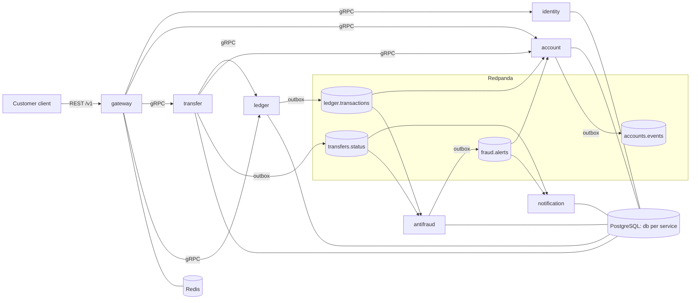
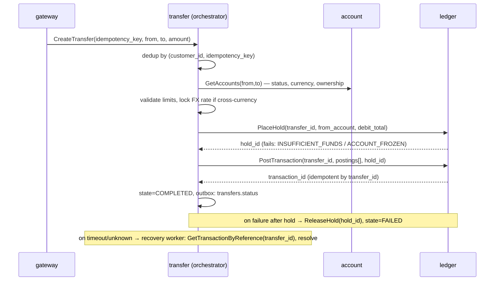

# bank-core — System Architecture

## 1. Context

Retail online-banking core. External actors: **Customer** (mobile/web client — out of
scope, simulated with curl/.http files) and **Bank staff** (support/admin roles).
All external traffic enters through the API gateway over HTTPS/JSON. Internally,
synchronous calls are gRPC; asynchronous facts are Kafka events.



## 2. Ownership map

| Entity | Owner | Others hold |
|---|---|---|
| User, credentials, session, role | identity | gateway: JWT claims only |
| Account (number, currency, status, customer link) | account | ledger: mirrored ledger account row; transfer: reads via gRPC |
| **Balance** | **ledger** (derived from postings, materialized) | account: eventual projection for read API |
| Journal entry, posting, hold | ledger | nobody |
| Transfer, FX rate, limits, idempotency key | transfer | notification/antifraud: consume events |
| Fraud alert, rules state | antifraud | account: consumes freeze commands as events |

**Key rule:** money truth lives only in the ledger. `account.balance` shown to users
is an eventually-consistent projection (staleness target < 1s, versioned to be safe
against reordering). Any operation that changes money goes through a ledger journal
entry; the ledger enforces invariants and is the only writer to balances.

## 3. Consistency model

| Operation | Guarantee | Mechanism |
|---|---|---|
| Posting a journal entry (both legs) | Strongly consistent, atomic | Single DB transaction in ledger |
| Hold → capture within a transfer | Strongly consistent per step; saga across steps | Orchestrated saga with compensation (release hold) + recovery worker |
| Balance shown in `GET /v1/accounts` | Eventual (<1s) | Projection from `ledger.transactions`, per-account version guard |
| Fraud scoring | Eventual, post-factum | Kafka consumer; can emit freeze → future transfers blocked |
| Notifications | Eventual, at-least-once | Kafka consumer with retry/DLQ |

## 4. Money transfer — the core flow

Two-phase (authorization/capture style) so the saga has a real compensation path.



Saga state machine (persisted in `transfer.transfers.state`, every change appends to
`transfer_events` table):

`CREATED → VALIDATING → HELD → POSTING → COMPLETED`
failure edges: `VALIDATING → FAILED(reason)`, `HELD → RELEASING → FAILED`,
`POSTING → ?` (unknown) resolved by recovery worker into `COMPLETED` or `RELEASING`.

The recovery worker scans transfers stuck in `HELD`/`POSTING` older than N seconds and
resolves them by querying the ledger (the ledger is idempotent by `transfer_id`, so
re-sending `PostTransaction` after an ambiguous timeout is safe).

### Cross-currency (KZT ↔ USD)

Ledger holds internal FX position accounts per currency. A USD→KZT P2P produces one
journal entry with four postings, each currency summing to zero:

```
debit  customer USD account          -amount_usd
credit fx_position_usd               +amount_usd
debit  fx_position_kzt               -amount_kzt (amount_usd × locked rate)
credit beneficiary KZT account       +amount_kzt
```

Rates are a seeded table in transfer_db (`rates: pair, buy, sell, valid_from`); the
applied rate is stored on the transfer row (audit).

## 5. Eventing

- Delivery: **at-least-once**. Producers use the outbox pattern (same-transaction
  insert + relay). Consumers deduplicate via `processed_messages` in the same DB
  transaction as their side effect. Exactly-once is explicitly not pursued (ADR-0009).
- Ordering: partition key = `account_id` for `ledger.transactions` per-posting events
  and `accounts.events`; `transfer_id` for `transfers.status`; `customer_id` for
  `fraud.alerts`. Balance projections additionally carry a monotonic
  `balance_version` computed inside the ledger transaction, so even a reordered
  consumer converges (apply only if `version > current`).
- Retries: consumer-side, exponential backoff 1s→2s→4s→8s→16s (5 attempts), then
  produce to `<consumer_group>.<topic>.dlq` with headers `error`, `attempts`,
  `first_seen`. DLQ handling: manual (`make dlq-inspect` prints messages); a runbook
  documents replay.
- Schema: protobuf-encoded event payloads from the same buf module (envelope:
  `event_id (uuid v7)`, `occurred_at`, `request_id`, `payload`).

## 6. Security model

- Edge: gateway terminates auth. JWT RS256 access tokens (TTL 15m) validated against
  identity's JWKS (cached, refreshed on kid miss). Refresh tokens (TTL 30d, random
  256-bit, hashed at rest) live in `identity.sessions` with rotation on use and
  reuse detection (reuse → revoke whole session family).
- RBAC roles in token claims: `customer`, `support`, `admin`. Gateway enforces
  route-level role requirements; services additionally assert ownership
  (customer can only touch own accounts).
- Internal trust: services trust gRPC metadata claims injected by the gateway;
  documented threat model states the internal network is private (mTLS listed in
  roadmap).
- Idempotency: `Idempotency-Key` header required on `POST /v1/transfers`; stored
  business-side in transfer_db `(customer_id, key) → transfer_id` so retries return
  the same transfer. Gateway does not cache responses (ADR-0012).
- Rate limiting: Redis fixed-window per user+route at the gateway (429 + Retry-After).
- Audit: every state change already lands in append-only tables
  (`transfer_events`, journal entries are immutable, `sessions` history) — a separate
  audit service is roadmap.

## 7. Failure policy

| Dependency down | Behavior |
|---|---|
| ledger | transfers fail fast (circuit breaker open → 503 with problem+json); reads of balances served from account projections (marked `as_of`) |
| account | transfers fail (validation impossible); balance reads degrade to ledger direct call is **not** done — keep one path, return 503 |
| antifraud | transfers proceed (async scoring, product decision ADR-0010); alert backlog drains on recovery |
| notification | no user impact; backlog drains; DLQ after max attempts |
| Kafka | outbox accumulates, relay retries; system stays available for writes (key outbox property) |
| Redis | rate limiting fails open (allow + warn log), idempotency unaffected (DB-side) |

Every service: graceful shutdown (stop intake → drain in-flight ≤ 10s → close pools),
liveness `/healthz`, readiness `/readyz` (checks DB; consumers also check broker).

## 8. Observability

RED metrics per service (`http_/grpc_ request duration histogram, rate, errors`) +
business metrics: `transfers_total{state}`, `ledger_postings_total`,
`fraud_alerts_total{severity}`, `outbox_lag`, `consumer_lag`. Traces: gateway root
span → gRPC → DB (pgx instrumentation) → Kafka produce/consume links. Two provisioned
Grafana dashboards: "Platform RED" and "Money flow". Logs: slog JSON with
`request.id`, `service`, `customer.id` (where lawful).

## 9. Environments

- `make up`: compose profile `core` (~11 containers: 7 services, postgres, redpanda,
  redis, toxiproxy). Fits 16 GB laptop.
- `make up-observability`: adds prometheus, grafana, jaeger (profile `obs`).
- Helm chart + k3d: M3, mirrors compose topology, one values file.
